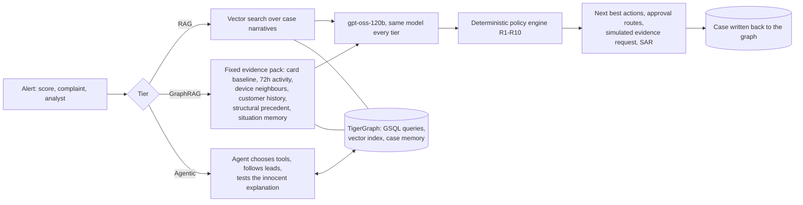

# Graphite

An agentic fraud investigator built on TigerGraph, for the TigerGraph Agentic
Fraud Investigation challenge (HHGOA).

Graphite takes an alert (a model score, a customer complaint, an analyst's
hunch), investigates it through the graph, decides what the bank should do
under its fraud policy, and knows when it needs more evidence before acting.
Each finished case is written back into the graph, where the next
investigation can find it.

The name is the idea: an investigation is a sketch, not a snapshot. It starts
faint, gets darker as evidence comes in, and gets filed the moment it's dark
enough to act on.

## What makes it different

**It was built to be measured honestly.** The challenge compares plain RAG,
GraphRAG and Agentic GraphRAG on the same model. Building that comparison
turned up several ways the obvious evaluation lies, and each one is fixed
rather than exploited:

- In the bank's closed cases, every confirmed fraud was opened by a customer
  report and every false alarm by a model score. Pass the trigger type through
  and any pipeline scores 100 percent for free. Eval alerts use a neutral
  trigger.
- The bank only investigated legitimate transactions when its model scored
  them high, so "high score means cleared" scores 91 percent on a naively
  balanced set. The eval set pairs every cleared case with a fraud case at
  the same risk score (within 0.01). A score-only rule now gets exactly 50
  percent.
- Fraud cases were opened a median of 22 hours after the transaction, false
  alarms within about 5. Investigating each case "as of when it was opened"
  leaks the label. Every eval case is investigated six hours after its
  flagged transaction, the same window the real exam cases have.
- Iteration happens on a separate dev split; the held-out eval runs once.

Every one of these is written up, with the numbers, in
[DECISIONS.md](DECISIONS.md).

**The data is counterintuitive, and the graph is what gets it right.** Once
the risk score is neutralised, real fraud here often looks mundane (in
person, on a familiar card) while false alarms look alarming (a new device,
online) because people buy new phones. General fraud intuition reads this
backwards: plain RAG on the dev split scored 42.5 percent with an AUC of
0.30, below chance. What fixes it is memory of how similar situations
actually ended. Every closed case carries a vector describing what the graph
looked like at alert time, stored in TigerGraph's vector index; on dev,
asking how the 15 most similar past situations ended scores 80 percent with
an AUC of 0.82 with no language model at all.

**It finds what isn't in the playbook.** The README warns that not every
pattern is documented. Exam case HHG-014 is an analyst request about "the
same unusual device profile" on several cards. One graph hop shows that
device was used 26 times in 30 days, every time new to the account and
behind an anonymous proxy, across 20 different customers, with four
confirmed fraud cases already on it. The flagged transaction had a risk
score of 0.05. The agent calls it an undocumented coordinated pattern, links
all 19 other cards, routes the block and the regulatory report for human
approval, and writes it all to the graph.

**The model never touches an action.** The agent proposes; a deterministic
policy engine implementing rules R1 to R10 (with tests against the rule
text) decides the actions and their approval routes. A fraudster who puts
instructions in a merchant field can't talk the model into moving money,
because the model can't.

## Architecture



All three tiers share one prompt (containing only what the dataset README
states), one output format and one policy engine. The only things that
change between tiers are retrieval and agency, so a difference in score can
be attributed to them.

## How TigerGraph is used

- **Schema** ([gsql/01_schema.gsql](gsql/01_schema.gsql)): customers, cards,
  transactions, device profiles, email domains, billing regions, closed
  cases, plus the live case layer the agent writes (FraudCase, Evidence,
  CaseAction). 2.4 million vertices and edges, every count verified against
  the source files.
- **Investigation queries** ([gsql/03_queries.gsql](gsql/03_queries.gsql)):
  card window, card baseline, device neighbours, customer overview, and
  structural precedent weighted by how rare the shared link is. Every query
  takes an as-of time and an exclusion set, so neither the future nor a
  held-out case can leak in.
- **Vector search** ([gsql/06_vector_queries.gsql](gsql/06_vector_queries.gsql),
  [gsql/07_documents.gsql](gsql/07_documents.gsql)): three indexes. Closed
  case narratives, closed case situation vectors, and the policy and pattern
  text, all retrieved inside TigerGraph with the same time and exclusion
  filters.
- **Case memory** ([src/graphite/case_store.py](src/graphite/case_store.py)):
  each finished case becomes a FraudCase vertex linked to its transactions,
  cards, devices, cited precedent, evidence and actions.

## Results

| | Graph memory only (no LLM) | RAG | GraphRAG | Agentic GraphRAG |
|---|---|---|---|---|
| accuracy | 85.7% | 44.0% | 73.8% | **75.6%** |
| AUC | 0.919 | 0.433 | 0.805 | **0.852** |
| Brier (lower is better) | 0.109 | 0.341 | 0.179 | **0.158** |
| fraud recall | 81.8% | 15.9% | 77.3% | 76.1% |
| legit specificity | 90.0% | 75.0% | 70.0% | 75.0% |
| fraud pattern named correctly | n/a | 8.0% | 44.3% | **51.1%** |
| tokens / case | 0 | 1,296 | 2,679 | 4,818 |
| LLM calls / case | 0 | 1.0 | 1.0 | 2.6 |

168 held-out cases (160 score-matched, 80 fraud and 80 cleared, plus 8 rare
patterns), `openai/gpt-oss-120b` on Groq for every tier, run once on frozen
code. GraphRAG beats RAG by 29.8 points (68 percent relative); the agent beats
RAG by 31.5 points (72 percent relative) and beats GraphRAG on ranking,
calibration and naming the pattern.

RAG lands below chance on purpose: once risk scores are matched, notes that
read alike are not situations that are alike. The memory-only row, graph
retrieval with no model at all, is the strongest single number. We keep it
in the table because it is the point: the signal lives in the graph, and the
model's job is to explain it, name the pattern and propose the action.

Exam: 20 cases answered by the agent, 10 fraud, 9 legitimate, 1 uncertain,
every file validated against the answer schema. Proactive: 5 ring cases
found by the graph with no alert, 3 judged fraud with SARs.

Full tables: [eval/RESULTS.md](eval/RESULTS.md) (held-out) and
[eval/RESULTS_dev.md](eval/RESULTS_dev.md) (dev). Regenerate with
`python -m graphite.report --set eval`.

## Running it

```bash
docker compose up -d                  # TigerGraph Community Edition 4.2.5
python3 -m venv .venv && .venv/bin/pip install -e .
cp .env.example .env                  # add GROQ_API_KEY
# put the HHGOA_IEEE files in data/
.venv/bin/python scripts/prepare_load.py
./scripts/rebuild_graph.sh            # schema, data, queries, vectors, policy docs

.venv/bin/python -m graphite.run --tier agentic --set exam     # the 20 answer files
.venv/bin/python -m graphite.run --tier rag --set eval         # and graphrag, agentic
.venv/bin/python -m graphite.report --set eval

.venv/bin/uvicorn graphite.ui.app:app --port 8765              # the interface
```

## Repo map

| Path | What's there |
|---|---|
| `design/` | The design phase: two independent reads of the brief, their comparison, the system design |
| `DECISIONS.md` | Every real decision and why, including the evaluation traps and how each was closed |
| `gsql/` | Schema, loading jobs, investigation queries, vector setup |
| `src/graphite/pipelines/` | The three tiers |
| `src/graphite/policy.py` | Policy rules R1 to R10, with tests in `tests/` |
| `src/graphite/evidence.py` | Graph results turned into short evidence lines |
| `src/graphite/situation.py` | The situation vector behind case memory |
| `eval/` | Held-out and dev case ids, and results |
| `cases/` | The 20 answer files for the submission |
